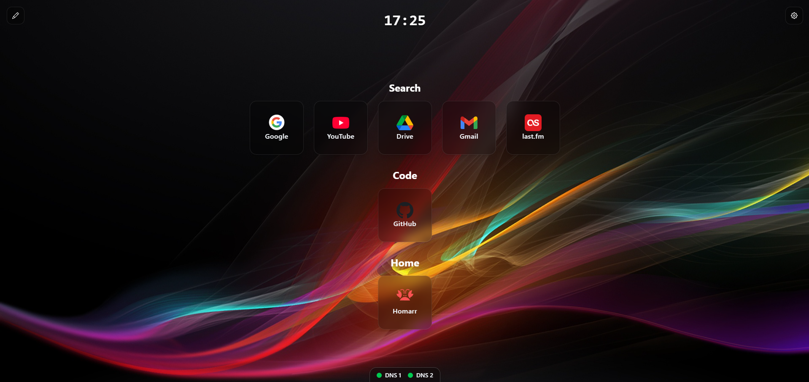
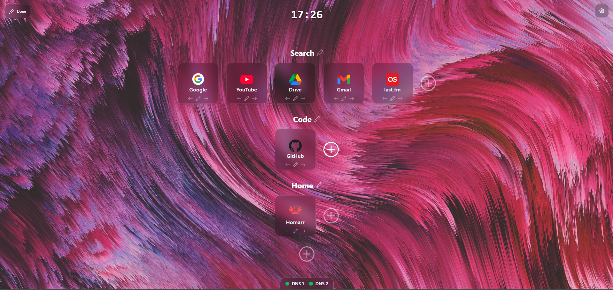
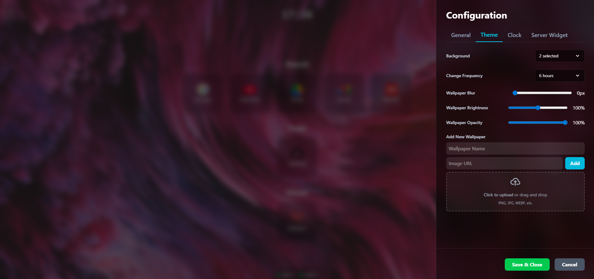

# Vision Start
#### A glassmorphism-looking like, modern and customizable startpage built with React.

## Screenshots





## Installing

Vision Start is not yet available on Chrome Web Store, but it can be installed manually:
1. Go to https://git.ivanch.me/ivanch/vision-start/releases/latest
2. Download the latest `vision-start-[version].zip` file
3. Extract the zip file, you will have a `vision-start` folder
4. Go to chrome://extensions/
5. Enable "Developer mode" in the top right corner
6. Click on "Load unpacked" and select the `vision-start` folder you extracted in step 3
7. The extension should now be installed! Just open a new tab to see it in action.

## Features

* **Customizable Website Tiles:** Add, edit, and organize your favorite websites for quick access.
* **Elegant Clock:** A clock because all startpages have one.
* **Server Status Widgets:** Monitor the status of services directly from the startpage.
* **Glassmorphism UI:** A modern and stylish interface with a frosted glass effect.
* **Icon Library:** It uses the [Dashboard Icon library](https://dashboardicons.com/) for a better look and feel. It also supports auto-fetch for some websites.
* **Future**: a long to do list :(

## Backgrounds

It comes with a selection of some nice pre-defined backgrounds: **Abstract**, **Abstract Red**, **Beach**, **Dark**, **Mountain**, **Waves**.

You can also upload your own images on it (or fetch it from the web).

## Running Locally

**Prerequisites:** Node.js

1.  Clone the repository:
```bash
git clone https://gitea.com/ivan/vision-start.git
cd vision-start
```
2.  Install dependencies:
```bash
npm install
```
3.  Run the development server:
```bash
npm run dev
```

## To-do

* [x] Multiple Wallpapers
* [x] Remake icons
* [] Increase offline compatibility (might not be possible)
  * Use chrome.storage.local for user wallpapers -- this one is
  * Use chrome.storage.local for some logos -- a bit hard
    * Some logos have CORS enabled, we can add `"<all_urls>"` to the manifest.json file and cache them on storage local
* Dynamic Weather Widget
  * A box with information about the current weather, with manual entry on the location
  * Display current temperature, weather condition (e.g., "Sunny," "Cloudy"), and a corresponding icon
  * Optionally, show a 3-day forecast when clicked or hovered
* Search Bar Widget
  * Positioned to the right or left side of the clock, display a nice search bar
  * Behaviour:
    * When not in focus, it could be highly transparent with just a faint border and a search icon.
    * When clicked, it would smoothly expand and become slightly more opaque, with a soft glow around the border (similar to the existing ones)
  * Config to allow changing the default search engine
* Draggable & Resizable Grid System
  * Allow users to drag and drop all widgets (Clock, Website Tiles, Weather, Title, etc.) into any position on a grid
* Notes / Scratchpad Widget
  * A simple text area that saves its content to local storage automatically.
  * Maybe some extra formatting (bold, italic, increase font size, etc).
* Theme-ing
  * A Light/Dark Mode toggle
  * Custom Accent Colors
    * Selection of 6-8 accent colors that are guaranteed to look good with both Light and Dark themes
    * Define CSS variables for the accent color
  * Dynamic Wallpaper-Based Theming
    * Automatically adapt the UI's accent color to match the current wallpaper
  * Minimal feel toggle
    * Disable title & subtitle and search widget
    * Tiles become small stylish lines

From a technical side:
* Refactor everything :(
* Add small nginx demo (with docker)
